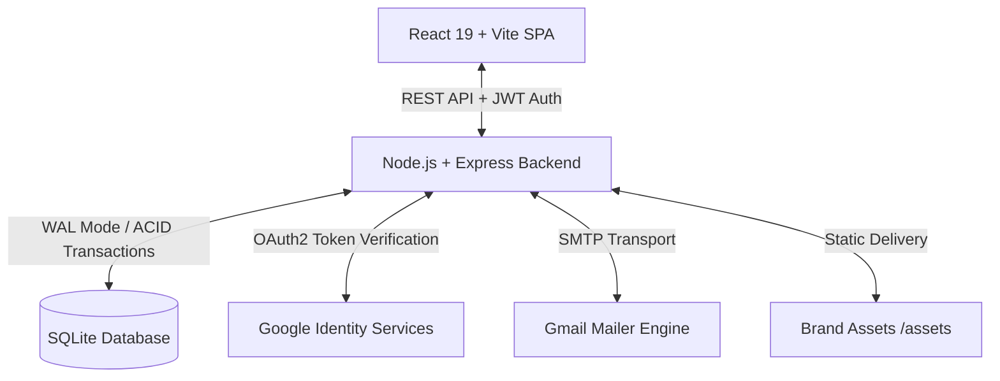

# 🌿 Kaithi Ayurveda — Full-Stack D2C E-Commerce Platform

> **Live Production Store:** [https://kaithi-ayurveda.onrender.com/](https://kaithi-ayurveda.onrender.com/)  
> **Author:** **Rushit Khakhkhar** (Final Year B.Tech Information Technology)  
> **Client / Practitioner:** Dr. Nidhi Khakhkhar (BAMS), Kaithi Ayurveda, Kodinar, Gujarat

---

## 📌 Executive Summary

**Kaithi Ayurveda** is a production-grade, full-stack Direct-to-Consumer (D2C) e-commerce platform engineered from scratch for an authentic Ayurvedic cosmetics brand. 

Designed and architected as a capstone-level production system, it combines a luxury responsive frontend with an enterprise-ready backend featuring **Google Identity authentication**, **real-time Email OTP verification via SMTP**, **cross-session persistent cart sync**, **0% commission direct UPI payments**, and a **dedicated role-based Admin Command Center**.

---

## 🌟 Key Engineering & Architectural Highlights



### 1. 🔐 Multi-Modal Authentication & Security Architecture
- **Official Google Sign-In (GSI)**: Integrated Google Identity Services with server-side JWT verification using `google-auth-library` (`verifyIdToken`).
- **Passwordless Email OTP Verification**: Integrated `nodemailer` with Gmail SMTP for real-time delivery of 6-digit branded verification codes with 10-minute expiry and 60-second client resend cooldowns.
- **Role-Based Access Control (RBAC)**: JWT-based claims (`customer` vs `admin`) with middleware protection (`authenticateToken`, `requireAdmin`).
- **Compliance & Consent**: Mandatory Terms of Service & Privacy Policy agreement required before authentication.

### 2. 🛒 Persistent Cross-Device Cart & State Engine
- **Database-Backed Cart Sync (`user_cart_items`)**: Cart state is persisted to SQLite, allowing customers to add items on one device and seamlessly access them on another upon logging in.
- **Smart Session Transition**: Automatically merges guest carts into user accounts upon authentication, while wiping client storage on sign-out for privacy without losing database records.
- **Dynamic Coupon Engine**: Real-time server-validated discount calculation supporting both flat and percentage-based promo codes (`FIRST10`, `AYURVEDA20`).

### 3. 💳 Flexible Omnichannel Payment Pipeline
- **Zero-Fee Direct UPI QR Engine**: Generates dynamic UPI deep-links and QR codes mapped directly to merchant VPA with instant one-click copy and 12-digit UTR reference tracking.
- **Doorstep Cash on Delivery (COD)**: Supports traditional e-commerce fulfillment with pending payment settlement.
- **Payment Gateway Ready**: Integrated with Razorpay SDK for standard credit/debit card and NetBanking transactions.

### 4. 🛡️ Role-Isolated Admin Command Center
- **Dedicated Management Portal (`/admin`)**: Fully hidden and isolated from standard customer sessions.
- **Live Order Pipeline**: Real-time tracking and status dispatching (`Placed` ➔ `Processing` ➔ `Shipped` ➔ `Delivered` ➔ `Cancelled`).
- **Courier Logistics Dispatcher**: Attach tracking codes (Delhivery, BlueDart, India Post) that update in real-time on the customer's portal.
- **Printable Tax Invoices**: Automatically generates GST-compliant printable invoices with customer address, itemization, and clinic branding.
- **Revenue Analytics**: Real-time tracking of gross sales, active formulations, and pending shipments.

---

## 🛠️ Technology Stack

| Layer | Technology |
| :--- | :--- |
| **Frontend Framework** | **React 19**, Vite, Vanilla CSS Design System |
| **Icons & UI** | Lucide React, Canvas Confetti |
| **Backend Runtime** | **Node.js**, **Express.js** (REST API) |
| **Database** | **SQLite** (`better-sqlite3`) with WAL journal mode |
| **Authentication** | Google Identity Services (GSI), JWT, BcryptJS |
| **Email Engine** | Nodemailer (Gmail SMTP Transport) |
| **Payments** | Direct UPI QR, Razorpay SDK, COD |
| **Hosting & Cloud** | **Render.com** (Continuous Deployment via GitHub, HTTPS SSL) |

---

## 📂 Project Architecture

```
kaithi-ayurveda/
├── client/                     # React 19 Frontend SPA
│   ├── src/
│   │   ├── components/         # Modular UI (Navbar, AuthModal, CartDrawer, HeroBanner, Footer)
│   │   ├── context/            # Global State (AuthContext, CartContext, ThemeContext)
│   │   ├── pages/              # Views (HomePage, ProductDetail, Checkout, Profile, Admin)
│   │   ├── index.css           # Luxury Ayurvedic Design Tokens & Glassmorphism
│   │   └── main.jsx            # React Root
│   ├── index.html              # HTML5 Shell with Google Fonts & GSI Script
│   └── vite.config.js          # Vite Build Config
├── server/                     # Node.js / Express Backend
│   ├── middleware/             # JWT & RBAC Auth Middleware
│   ├── routes/                 # Modular REST API Routes
│   │   ├── auth.js             # Google Auth, Email OTP, Profile
│   │   ├── products.js         # Product Catalog & Search
│   │   ├── orders.js           # Order Creation, Lifecycle & Invoicing
│   │   ├── cart.js             # Database Cart Persistence & Sync
│   │   ├── coupons.js          # Coupon Validation
│   │   └── payment.js          # Gateway Integration
│   ├── db.js                   # SQLite Schema & Seeding Engine
│   └── index.js                # Express Server Entry Point
├── assets/                     # Authentic High-Resolution Product & Botanical Imagery
├── package.json                # Root Build & Startup Scripts
└── README.md                   # Engineering Documentation
```

---

## 📡 REST API Specifications

| Method | Endpoint | Access | Description |
| :--- | :--- | :--- | :--- |
| `POST` | `/api/auth/google` | Public | Verify Google ID token and sign in / register |
| `POST` | `/api/auth/send-otp` | Public | Dispatch 6-digit verification code to email |
| `POST` | `/api/auth/verify-otp` | Public | Verify OTP code and issue JWT session token |
| `GET` | `/api/cart` | Authenticated | Retrieve persistent database cart for user |
| `POST` | `/api/cart/sync` | Authenticated | Merge and synchronize cart items |
| `POST` | `/api/orders` | Authenticated | Place new order with shipping details & items |
| `GET` | `/api/orders/my-orders` | Authenticated | Fetch customer order history & tracking |
| `GET` | `/api/orders/admin/stats` | Admin | Aggregate revenue, orders, and fulfillment stats |
| `PATCH`| `/api/orders/:id/status`| Admin | Update order status and courier tracking code |

---

## 💻 Local Development Setup

```bash
# 1. Clone the repository
git clone https://github.com/khakhkharrushit/kaithi-ayurveda.git
cd kaithi-ayurveda

# 2. Install all dependencies (Root + Client)
npm run build

# 3. Create .env in root directory
cp .env.example .env

# 4. Start backend & frontend concurrently
npm start
# App runs at: http://localhost:5000
```

---

## 👨‍💻 Developer Profile

**Rushit Khakhkhar**  
- **Degree:** B.Tech in Information Technology (4th Year)  
- **GitHub:** [@khakhkharrushit](https://github.com/khakhkharrushit)  
- **Live Demo:** [https://kaithi-ayurveda.onrender.com/](https://kaithi-ayurveda.onrender.com/)  

*Engineered with precision for Kaithi Ayurveda · Pure. Handmade. Ancient.*
